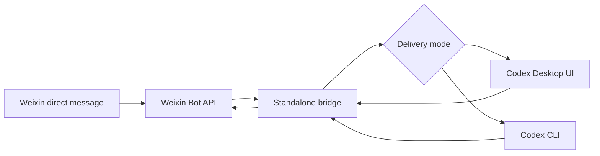

# Weixin Codex Bridge

[](https://github.com/workhard211/weixin-codex-bridge/actions/workflows/ci.yml)
[](LICENSE)

A standalone bridge from Weixin direct messages to Codex. It includes built-in Weixin bot QR login, polls text messages, sends the original text to Codex, and returns plain-text replies to Weixin.

Chinese version: [README.md](./README.md)

Language policy: Weixin-facing replies and the local console default to Simplified Chinese. Developer docs, command aliases, API paths, and JSON fields stay English for open-source maintenance and automation.

## What It Does

- Forwards Weixin direct-message text to Codex.
- Keeps local bridge state and Codex session mapping per Weixin conversation.
- Supports Codex Desktop UI delivery and a Codex CLI mode.
- Starts an optional local console for status and retry operations.

This project does not use OpenClaw channel routing, bindings, or multi-agent dispatch. New users log in directly through this project; old OpenClaw credentials are only read as a compatibility fallback.

## How It Differs From Other Bridges

- **Not an OpenClaw routing plugin**: it does not take over OpenClaw channel routing, bindings, or multi-agent dispatch, and it does not rewrite OpenClaw configuration. Weixin bot login is handled by this project's own `npm run login` command.
- **Not just a CLI forwarder**: Desktop UI delivery is the default, so Weixin messages can land in the live Codex Desktop session. Codex CLI mode is still available when a shell-based workflow is preferred.
- **No prompt wrapping**: the text sent to Codex is the original Weixin message text. The bridge does not prepend sender names, timestamps, routing hints, markdown wrappers, or hidden control instructions.
- **Per-Weixin-conversation state**: each Weixin conversation has its own local state, Codex conversation binding, failed-task queue, and transcript mirror, which makes delivery issues auditable.
- **Built for Desktop automation reliability**: Desktop delivery does not rely only on fixed coordinates. The scripts include UI Automation lookup, DPI-aware coordinates, screenshot detection, calibration caching, and a pre-send detector.
- **Local-first and open-source friendly**: runtime state and new login credentials stay in a user-configured local directory, old OpenClaw credentials are read-only compatibility input, and the repo includes setup preflight checks, public-release checks, CI, failed-task handling, and a local console.

## Architecture



## Requirements

- Node.js `>= 22`
- Codex Desktop or Codex CLI installed and authenticated
- Weixin bot account credentials created by this project's built-in QR login
- Windows 10/11 is recommended for Desktop UI automation; CLI mode can run in a more generic shell environment

## Do Users Need OpenClaw First?

No. The current version includes a Weixin bot QR login flow: run `npm run login`, scan and confirm in Weixin, and the project saves credentials into its own state directory, for example `CODEX_WEIXIN_STATE_ROOT\weixin-auth\openclaw-weixin\accounts.json`.

`OPENCLAW_STATE_DIR` is now only a compatibility option. Existing users can point it at an old OpenClaw `openclaw-weixin` state directory, while new users can log in through this project without downloading or starting OpenClaw separately. The launcher still checks ports `18789` and `8787` to avoid colliding with OpenClaw or an older bridge.

## Quick Start

```powershell
git clone https://github.com/workhard211/weixin-codex-bridge.git
cd weixin-codex-bridge
npm install
npm run init
npm run login
npm start
```

`npm run init` creates or updates the current directory's `.env`; usually the only value you need to confirm is the Codex workspace. You can also copy and edit the template manually: `Copy-Item .env.example .env`.

Note: the app automatically loads `.env` from the current directory. Values already exported by your shell, terminal profile, process manager, or CI secrets take priority. `.env.example` is a public template only; never commit real credentials.

Non-interactive PowerShell setup example:

```powershell
npm run init -- --workspace "C:\work\my-codex-project" --delivery-mode desktop-ui
npm run login
npm start
```

To bypass Desktop UI and use Codex CLI:

```powershell
$env:CODEX_WEIXIN_DELIVERY_MODE = "codex-cli"
$env:CODEX_WEIXIN_CLI_FALLBACK = "false"
npm start
```

## Key Environment Variables

| Variable | Purpose |
| --- | --- |
| `CODEX_WEIXIN_CWD` | Workspace directory where Codex should run. |
| `CODEX_WEIXIN_ENV_FILE` | Optional shell-level override for a non-default `.env` file path. |
| `CODEX_WEIXIN_AUTH_ROOT` | Optional Weixin credential root; defaults to `CODEX_WEIXIN_STATE_ROOT\weixin-auth`. |
| `OPENCLAW_STATE_DIR` | Optional compatibility root for existing OpenClaw `openclaw-weixin` account state. |
| `OPENCLAW_CONFIG_PATH` | Optional source for legacy OpenClaw route tags. |
| `CODEX_WEIXIN_ACCOUNT_ID` | Optional Weixin account ID; the first saved account is used when unset. |
| `CODEX_WEIXIN_STATE_ROOT` | Bridge runtime state, logs, and local queue directory. |
| `CODEX_WEIXIN_LOG_ROOT` | Backward-compatible alias; if both roots are set, this value wins. |
| `CODEX_WEIXIN_CONSOLE_ENABLED` | Enables the local console, default `true`. |
| `CODEX_WEIXIN_CONSOLE_PORT` | Local console port, default `18790`. |
| `CODEX_WEIXIN_DELIVERY_MODE` | `desktop-ui` or `codex-cli`. |
| `CODEX_WEIXIN_MAX_PARALLEL` | Maximum parallel worker lanes for `codex-cli`; `desktop-ui` is always single-lane. |
| `CODEX_WEIXIN_CLI_FALLBACK` | Whether Desktop UI failures may fall back to CLI, default `false`. |
| `CODEX_DESKTOP_APP_ID` | Optional Windows AppID override for launching Codex Desktop. |
| `CODEX_WEIXIN_MODEL` | Codex CLI model name. |

See [.env.example](./.env.example) for the full template.

On a new computer, or after moving/resizing the Desktop setup, run the local preflight first:

```powershell
npm run setup-check
# Or run directly:
powershell -ExecutionPolicy Bypass -File scripts\Test-CodexWeixinSetup.ps1
```

It also reads the current directory's `.env`, then performs read-only checks for Node/npm, the built entrypoint, Weixin account index, Codex Desktop AppID, visible Codex window, desktop input/model scripts, console status, and ports `18789`/`8787`. Add `-Json` when another tool should consume the report.

## Most Common Configuration Failures

- Missing Weixin credentials: run `npm run login` and scan the QR code. If reusing old OpenClaw credentials, set `OPENCLAW_STATE_DIR` to the state root that contains `openclaw-weixin/accounts.json`.
- Missing `CODEX_WEIXIN_CWD`: run `npm run init` and set it to the real workspace Codex should operate in.
- `CODEX_WEIXIN_MAX_PARALLEL>1` in `desktop-ui`: this is ignored because one Codex Desktop window must stay single-lane.
- Wrong `CODEX_WEIXIN_DESKTOP_INPUT_SCRIPT` or `CODEX_WEIXIN_DESKTOP_MODEL_SCRIPT`: input detection, paste, or model switching will fail.
- `codex-cli` or `CODEX_WEIXIN_CLI_FALLBACK=true` with a broken `CODEX_CMD_PATH`: CLI fallback will fail.
- Ports `18789` or `8787` already owned by OpenClaw or an old bridge: launcher scripts and diagnostics will flag this.

The console `Run Diagnostics` action now lists these configuration checks with fix suggestions.

## NPM Scripts

```powershell
npm run init           # Build automatically and create/update .env
npm run login          # Build automatically and scan a Weixin bot QR code
npm start              # Build automatically and start the bridge
npm run build          # Compile TypeScript into dist/
npm test -- --run      # Run tests
npm run setup-check    # Run local machine setup preflight
npm run public-check   # Run privacy and repository hygiene checks
```

## Repository Hygiene

- Do not commit `.env`, QR codes, screenshots, logs, runtime state, Codex transcripts, or Weixin account credentials.
- `dist/`, `node_modules/`, `.local/`, and common debug artifacts are ignored by default.
- Run `npm run public-check` before publishing or opening a pull request.
- See [docs/open-source-checklist.md](./docs/open-source-checklist.md).

## References

- Tencent Weixin OpenClaw installer (optional legacy-credential compatibility reference only): <https://www.npmjs.com/package/@tencent-weixin/openclaw-weixin-cli>
- Tencent Weixin OpenClaw plugin (optional legacy credential format reference only): <https://www.npmjs.com/package/@tencent-weixin/openclaw-weixin>
- ACPX: <https://www.npmjs.com/package/acpx>

## License

MIT
