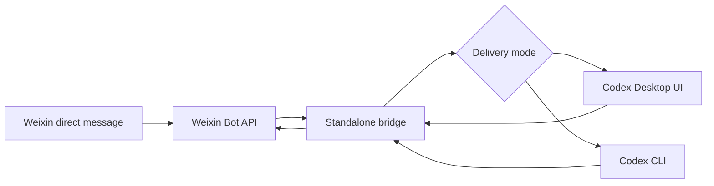

# Weixin Codex Bridge

[](https://github.com/workhard211/weixin-codex-bridge/actions/workflows/ci.yml)
[](LICENSE)

一个独立的微信到 Codex 桥接器。它内置微信 bot 二维码登录，轮询微信私聊文本消息，把原始文本转交给 Codex，再把纯文本回复发回微信。

English version: [README.en.md](./README.en.md)

默认语言策略：微信用户可见回复和本地控制台默认使用简体中文；开发者文档、命令别名、API 路径和 JSON 字段保留英文，便于开源维护和自动化集成。

## 适用场景

- 把微信私聊文本转发到 Codex。
- 每个微信会话使用独立的本地状态和 Codex 会话记录。
- 支持 Codex Desktop UI 投递，也可以切到 Codex CLI 模式。
- 提供本地控制台端口，用于观察运行状态和重试失败任务。

本项目不依赖 OpenClaw 的 channel routing、bindings 或多 agent 分发；新用户直接在本项目里扫码登录即可，旧 OpenClaw 凭据只作为兼容 fallback 读取。

## 与其他桥的区别

- **不是 OpenClaw 路由插件**：不接管 OpenClaw 的 channel routing、bindings 或多 agent 分发，也不改写 OpenClaw 配置；微信 bot 登录由本项目自己的 `npm run login` 完成。
- **不是简单 CLI 转发器**：默认优先投递到 Codex Desktop UI，可以把微信消息落到正在使用的 Codex 桌面会话里；需要时也可以切到 Codex CLI 模式。
- **不包装微信原文**：发给 Codex 的 prompt 保留微信文本本身，不自动拼接发送人、时间戳、路由提示或隐藏控制信息，避免污染 Codex 上下文。
- **按微信会话维护状态**：每个微信会话有独立的本地状态、对话绑定、失败任务和记录镜像，方便排查“消息有没有真正进入 Codex”。
- **面向桌面自动化可靠性**：桌面投递不是只靠固定坐标；脚本包含 UI Automation、DPI 感知、截图检测、校准缓存和投递前检测，适合窗口大小、显示比例变化的机器。
- **本地优先、开源友好**：运行状态和新登录凭据写入用户配置的本地目录，旧 OpenClaw 凭据只读兼容；仓库提供预检脚本、公开发布检查、CI、故障任务处理和本地控制台，方便在新电脑复现。

## 架构



## 要求

- Node.js `>= 22`
- 已安装并登录 Codex Desktop 或 Codex CLI
- 可使用本项目内置扫码登录生成微信 bot 账号凭据
- Windows 10/11 推荐用于 Desktop UI 自动化；CLI 模式可用于更普通的 shell 环境

## 是否必须先安装 OpenClaw？

不需要。当前版本已经内置微信 bot 二维码登录：运行 `npm run login` 后，用微信扫码确认，项目会把凭据保存到自己的状态目录，例如 `CODEX_WEIXIN_STATE_ROOT\weixin-auth\openclaw-weixin\accounts.json`。

`OPENCLAW_STATE_DIR` 现在只是兼容旧用户：如果你以前已经用 OpenClaw 登录过，可以继续指向旧的 `openclaw-weixin` 状态目录；新用户直接用本项目登录即可，不需要额外下载或启动 OpenClaw。启动脚本仍会检查 `18789` 和 `8787`，避免和 OpenClaw/旧桥同时占用同一套本地服务。

## 快速开始

```powershell
git clone https://github.com/workhard211/weixin-codex-bridge.git
cd weixin-codex-bridge
npm install
npm run init
npm run login
npm start
```

`npm run init` 会生成或更新当前目录的 `.env`，通常只需要确认 Codex 工作目录；其他值都有默认值。也可以手动复制模板再编辑：`Copy-Item .env.example .env`。

说明：项目从当前目录自动加载 `.env`，shell、Windows Terminal profile、进程管理器或 CI secret 中已经存在的环境变量会优先生效。`.env.example` 只是公开模板，真实凭据不要提交。

PowerShell 非交互初始化示例：

```powershell
npm run init -- --workspace "C:\work\my-codex-project" --delivery-mode desktop-ui
npm run login
npm start
```

如果你要绕开 Desktop UI，改用 Codex CLI：

```powershell
$env:CODEX_WEIXIN_DELIVERY_MODE = "codex-cli"
$env:CODEX_WEIXIN_CLI_FALLBACK = "false"
npm start
```

## 常用环境变量

| 变量 | 说明 |
| --- | --- |
| `CODEX_WEIXIN_CWD` | Codex 要工作的项目目录。 |
| `CODEX_WEIXIN_ENV_FILE` | 可选，启动前在 shell 中设置，指定非默认 `.env` 文件路径。 |
| `CODEX_WEIXIN_AUTH_ROOT` | 可选，微信登录凭据根目录；默认是 `CODEX_WEIXIN_STATE_ROOT\weixin-auth`。 |
| `OPENCLAW_STATE_DIR` | 可选兼容项，读取已有 OpenClaw `openclaw-weixin` 账号状态。 |
| `OPENCLAW_CONFIG_PATH` | 可选，读取旧 OpenClaw 配置中的 route tag。 |
| `CODEX_WEIXIN_ACCOUNT_ID` | 可选，指定要使用的微信账号 ID；不填时使用账号列表中的第一个。 |
| `CODEX_WEIXIN_STATE_ROOT` | 桥接器运行状态、日志和本地队列目录。 |
| `CODEX_WEIXIN_LOG_ROOT` | 兼容旧名称；如果和 `CODEX_WEIXIN_STATE_ROOT` 同时设置，优先使用它。 |
| `CODEX_WEIXIN_CONSOLE_ENABLED` | 是否开启本地控制台，默认 `true`。 |
| `CODEX_WEIXIN_CONSOLE_PORT` | 本地控制台端口，默认 `18790`。 |
| `CODEX_WEIXIN_DELIVERY_MODE` | `desktop-ui` 或 `codex-cli`。 |
| `CODEX_WEIXIN_MAX_PARALLEL` | `codex-cli` 的最大并行 worker 数；`desktop-ui` 始终保持单通道。 |
| `CODEX_WEIXIN_CLI_FALLBACK` | Desktop UI 失败后是否自动退回 CLI，默认 `false`。 |
| `CODEX_DESKTOP_APP_ID` | 可选，覆盖 Windows 启动 Codex Desktop 的 AppID。 |
| `CODEX_WEIXIN_MODEL` | Codex CLI 模型名，默认随代码配置。 |

完整模板见 [.env.example](./.env.example)。

在新电脑或窗口位置变动后，先跑一次本机预检：

```powershell
npm run setup-check
# 或直接运行：
powershell -ExecutionPolicy Bypass -File scripts\Test-CodexWeixinSetup.ps1
```

它同样会读取当前目录的 `.env`，然后只读检查 Node/npm、已编译入口、Weixin 账号索引、Codex Desktop AppID、Codex 窗口、桌面输入/模型脚本、控制台状态，以及 `18789`/`8787` 端口占用；需要接到其他工具时可加 `-Json` 输出结构化结果。

## 最容易配置失败的地方

- 微信账号凭据缺失：先运行 `npm run login` 扫码；如果要复用旧 OpenClaw 凭据，再设置 `OPENCLAW_STATE_DIR` 指向包含 `openclaw-weixin/accounts.json` 的状态目录。
- `CODEX_WEIXIN_CWD` 不存在：先运行 `npm run init`，把它设成要让 Codex 操作的真实项目目录。
- `desktop-ui` 下误配 `CODEX_WEIXIN_MAX_PARALLEL>1`：这个值会被忽略，因为单个 Codex Desktop 窗口必须单通道。
- `CODEX_WEIXIN_DESKTOP_INPUT_SCRIPT` 或 `CODEX_WEIXIN_DESKTOP_MODEL_SCRIPT` 路径不对：会导致输入框检测、粘贴或模型切换失败。
- 开启 `codex-cli` 或 `CODEX_WEIXIN_CLI_FALLBACK=true` 但 `CODEX_CMD_PATH` 不可用：CLI fallback 会失败。
- 端口 `18789` 或 `8787` 被 OpenClaw/旧桥占用：启动脚本会拦截，控制台诊断也会提示。

控制台的 `Run Diagnostics` 会直接列出这些配置检查和修复建议。

## NPM 脚本

```powershell
npm run init           # 自动编译并生成/更新 .env
npm run login          # 自动编译并扫码登录微信 bot
npm start              # 自动编译并启动桥接器
npm run build          # 编译 TypeScript 到 dist/
npm test -- --run      # 运行测试
npm run setup-check    # 运行本机配置预检
npm run public-check   # 发布前隐私和仓库卫生检查
```

## 仓库卫生

- 不要提交 `.env`、二维码、截图、日志、运行状态、Codex transcript、微信账号凭据。
- `dist/`、`node_modules/`、`.local/` 和常见 debug 产物默认被忽略。
- 发布或开 PR 前运行 `npm run public-check`。
- 清单见 [docs/open-source-checklist.md](./docs/open-source-checklist.md)。

## 参考资料

- Tencent Weixin OpenClaw installer（仅旧凭据兼容参考，非必装）: <https://www.npmjs.com/package/@tencent-weixin/openclaw-weixin-cli>
- Tencent Weixin OpenClaw plugin（仅旧凭据格式参考，非必装）: <https://www.npmjs.com/package/@tencent-weixin/openclaw-weixin>
- ACPX: <https://www.npmjs.com/package/acpx>

## License

MIT
